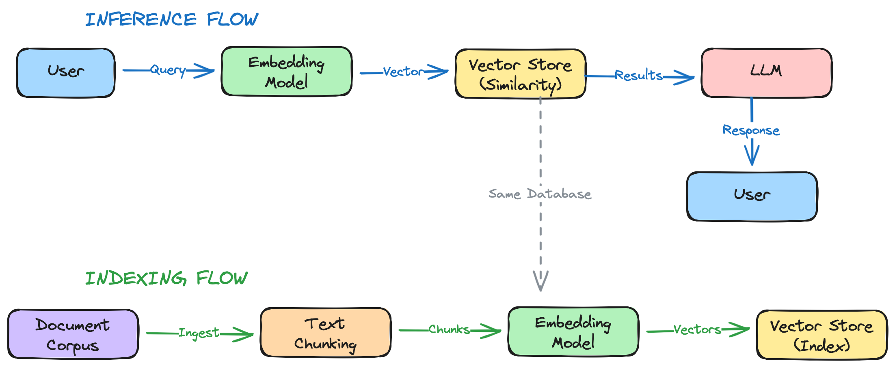

This is a summary of vector search and how to leverage Databricks Mosaic AI Vector Search

---

## Vector Search

According to the Databricks docs on Vector Search

>Vector search is a type of search optimized for retrieving embeddings. Embeddings are mathematical representations of the semantic content of data, typically text or image data. Embeddings are generated by a large language model and are a key component of many generative AI applications that depend on finding documents or images that are similar to each other. Examples are RAG systems, recommender systems, and image and video recognition.
>
>Source: [What is Mosaic AI Vector Search?](https://docs.databricks.com/aws/en/vector-search/vector-search#what-is-mosaic-ai-vector-search)

In summary, embeddings are calculated in one of multiple ways (more on this later), then used in one of numerous scenarios such as similarity search.

Vector databases are often used in RAG (Retrieval Augmened Generation) architectures. This diagram shows a RAG architecture from both a user inference perspective and the ingestion/embedding flow.



> The prompt
>
> create an excalidram diagram of a typical RAG application architecture using a vector store. It should show 1) a flow both from a user perspective during inference to retrieve the similarity search results and 2) a flow of how the index is maintained via corpus ingest and embedding creation

---

## How to calculate embeddings in Databricks

There are 2 primary ways to calculate embeddings

- [Delta Sync Index](#delta-sync-index)
- [Direct Vector Access Index](#direct-vector-access-index)

### Delta Sync Index

This approach could look like:

- `Delta Table --> Embedding Model --> Vector Index`

And the Delta Sync will keep the vector database in sync with the source Delta Table via a Databricks-managed Spark Declarative Pipeline.

There are two variations of this approach, dependent on whether you bring your own pre-computed embeddings or whether the embeddings are computed by Databricks

### Direct Vector Access Index

With this approach, there is no sync process and changes to the index need to manually maintained:

- `REST API to manage the index --> Vector Index`

---

## Deploy a Vector Search Index

### Data Preparation

In this scenario, we'll use a sample dataset from the public IMDB datasets. We'll filter the data down to a subset containing only USA-made movies given that it takes some time to calculate the embeddings in the vector index.

First, get the titles dataset and drop it into a UC Volume path:

```python
# https://github.com/sahildit/IMDB-Movies-Extensive-Dataset-Analysis/blob/master/data1/IMDb%20movies.csv

imdb_movies_df = (
    spark.read.format("csv")
    .option("delimiter", ",")
    .option("header", "true")
    .option("nullValue", "\\N")
    .load("dbfs:/Volumes/workspace/default/my_volume/IMDB_movies.csv")
)

# imdb_movies_df.count()
# #️⃣ 85855

from pyspark.sql import functions as f

usa_movies_df = (
        imdb_movies_df.filter("country = 'USA'")
        .filter(
            f.col("avg_vote").try_cast("double").isNotNull() # filter out some bad data
        )
    )

# usa_movies_df.count()
# #️⃣ 27804
```

```python
# filter just the columns of interest
prepared_df = usa_movies_df.select(
    "imdb_title_id", "original_title", "genre", "description", "avg_vote", "year"
)

# create a zero-row table with the schema of interest
prepared_df.limit(0).write.mode("overwrite").saveAsTable("workspace.default.movies")
```

Enable CDF on the table.

```sql
ALTER TABLE
  workspace.default.movies
SET TBLPROPERTIES
  (delta.enableChangeDataFeed = true)
```

Then write the dataset in entirety to the `movies` table.

```python
prepared_df.write.mode("overwrite").saveAsTable("workspace.default.movies")
```

---

### Create the Endpoint

In this scenario, we will use the `VectorSearchClient` to setup the vector search endpoint and vector search index, however, in production, a more established IaC approach such as Terraform may be preferred.

Install the `databricks-vectorsearch` library:

```python
%pip install databricks-vectorsearch
dbutils.library.restartPython()
```

Instantiate the `VectorSearchClient`

```python
from databricks.vector_search.client import VectorSearchClient

vsc = VectorSearchClient()

vs_endpoint_name = "my_vs_endpoint"
index_name = "workspace.default.movies_vsi"
embedding_model_endpoint_name = "databricks-bge-large-en"
```

Create the Vector Search Endpoint with the `VectorSearchClient` SDK using the provided Embedding Model

```python
response = vsc.create_endpoint(
    name=vs_endpoint_name,
    endpoint_type="STANDARD"
)

print(response)
{'name': 'my_vs_endpoint', 'creator': 'myemail@gmail.com', 'creation_timestamp': 1766372457790, 'last_updated_timestamp': 1766372457790, 'endpoint_type': 'STANDARD', 'last_updated_user': 'myemail@gmail.com', 'id': '7d7aa947-d101-4f60-b739-d87928c6ff9a', 'endpoint_status': {'state': 'PROVISIONING'}, 'num_indexes': 0}
```

### Create the index

Create the index using the `VectorSearchClient` SDK.

```python
index = vsc.create_delta_sync_index(
    endpoint_name=vs_endpoint_name,
    index_name=index_name,
    source_table_name="workspace.default.movies",
    pipeline_type="TRIGGERED",  # or "CONTINUOUS"
    primary_key="imdb_title_id",
    embedding_source_column="description",  # Column to generate embeddings from
    columns_to_sync=["original_title", "genre", "avg_vote", "year"],
    embedding_model_endpoint_name="databricks-bge-large-en"  # Databricks-hosted embedding model
)

index.describe()
{'name': 'workspace.default.movies_vsi',
 'endpoint_name': 'my_vs_endpoint',
 'primary_key': 'imdb_title_id',
 'index_type': 'DELTA_SYNC',
 'delta_sync_index_spec': {'source_table': 'workspace.default.movies',
  'embedding_source_columns': [{'name': 'description',
    'embedding_model_endpoint_name': 'databricks-bge-large-en'}],
  'pipeline_type': 'TRIGGERED',
  'pipeline_id': '340f4aee-c5eb-4a9f-812c-3ca03abf855b'},
 'status': {'detailed_state': 'PROVISIONING_ENDPOINT',
  'message': 'Delta sync index creation is pending endpoint provisioning.',
  'ready': False,
  'index_url': 'redacted.cloud.databricks.com/api/2.0/vector-search/indexes/workspace.default.movies_vsi'},
 'creator': 'myemail@gmail.com',
 'endpoint_type': 'STANDARD',
 'id': '7fc40e8e-3792-4781-a601-64da436b6d87'}
```

Get the status of the index using:

```python
index = vsc.get_index(endpoint_name=vs_endpoint_name, index_name=index_name)

index.describe()
{'name': 'workspace.default.movies_vsi',
 'endpoint_name': 'my_vs_endpoint',
 'primary_key': 'imdb_title_id',
 'index_type': 'DELTA_SYNC',
 'delta_sync_index_spec': {'source_table': 'workspace.default.movies',
  'embedding_source_columns': [{'name': 'text_content',
    'embedding_model_endpoint_name': 'databricks-bge-large-en'}],
  'pipeline_type': 'TRIGGERED',
  'pipeline_id': '221398d8-dc7b-417e-851a-6d084fe9d850'},
 'status': {'detailed_state': 'ONLINE_NO_PENDING_UPDATE',
  'message': 'Index creation succeeded. Check latest status: https://<redacted>.cloud.databricks.com/explore/data/workspace/default/movies_vsi',
  'indexed_row_count': 28511,
  'triggered_update_status': {'last_processed_commit_version': 5,
   'last_processed_commit_timestamp': '2025-12-26T03:48:52Z'},
  'ready': True,
  'index_url': '<redacted>.cloud.databricks.com/api/2.0/vector-search/indexes/workspace.default.movies_vsi'},
 'creator': 'myemail@gmail.com',
 'endpoint_type': 'STANDARD',
 'id': 'ece87720-4c28-4435-a8c2-649adaeb32b0'}
```

## Use the vector search index

Here's an example of returning a similarity search with a query filter. More deatils on the filter syntax can be found in [Use filters on queries](https://docs.databricks.com/aws/en/vector-search/query-vector-search?language=Python%C2%A0SDK%C2%A0standard%C2%A0endpoint#use-filters-on-queries).

```python
index = vsc.get_index(endpoint_name=vs_endpoint_name, index_name=index_name)

results = index.similarity_search(
    query_text="A thrilling family-friendly space adventure with robots",
    columns=["original_title", "avg_vote", "year", "genre"],
    filters={"avg_vote >": 8.0},
    num_results=5,
    query_type="ann" # [hybrid|FULL_TEXT]
)

for doc in results["result"]["data_array"]:
    print(doc)
['WALL·E', '8.4', '2008', 'Animation, Adventure, Family', 0.5980098]
['Benji the Dove', '8.2', '2017', 'Adventure, Drama, Family', 0.5163004]
['The Kid', '8.3', '1921', 'Comedy, Drama, Family', 0.44230592]
['The Princess Bride', '8.1', '1987', 'Adventure, Family, Fantasy', 0.4402268]
['All You Can Dream', '8.8', '2012', 'Comedy, Drama, Family', 0.43347055]
```

---

## Get embedding values with the MLflow deploy client

```python
from mlflow.deployments import get_deploy_client

deploy_client = get_deploy_client("databricks")

embeddings = deploy_client.predict(
    endpoint=embedding_model_endpoint_name,
    inputs={"input": ["a low-rated movie", "a high-rated movie"]}
)
print(embeddings)
{'id': '7206f91d-7670-4afc-ab59-8e49e921ddc3', 'object': 'list', 'model': 'bge-large-en-v1.5', 'data': [{'index': 0, 'object': 'embedding', 'embedding': [0.060791015625, 0.007152557373046875, 0.003086090087890625, -3.457069396972656e-05, -0.053131103515625, -0.0169219970703125, -0.01088714599609375, 0.00502777099609375, -0.0285491943359375, -0.01009368896484375, 0.0191802978515625, 0.033660888671875, -0.0273590087890625, ...
```

---

## Search with Langchain

```python
from databricks.vector_search.client import VectorSearchClient
from databricks_langchain import DatabricksVectorSearch, DatabricksEmbeddings
from langchain_core.vectorstores import VectorStoreRetriever

embedding_model = DatabricksEmbeddings(endpoint=embedding_model_endpoint_name)
print(embedding_model.embed_query("a low-rated movie")[:10])
[0.060791015625, 0.007152557373046875, 0.003086090087890625, -3.457069396972656e-05, -0.053131103515625, -0.0169219970703125, -0.01088714599609375, 0.00502777099609375, -0.0285491943359375, -0.01009368896484375]
```

```python
# retrieve the docs
def get_retriever(
    index_name: str, k: int = 5, search_type: str = "similarity"
) -> VectorStoreRetriever:
    vs_index = vsc.get_index(index_name=index_name)

    # create the retriever
    vectorstore = DatabricksVectorSearch(index_name=index_name)
    retriever = vectorstore.as_retriever(
        search_type=search_type, search_kwargs={"k": 3}
    )
    return retriever

retriever = get_retriever(index_name=index_name)
docs = retriever.invoke("a low-rated movie")

print(docs)
[Document(metadata={'imdb_title_id': 'tt0462250'}, page_content='A low-tech FX film about the horrors of war and robots.'), Document(metadata={'imdb_title_id': 'tt1523972'}, page_content='A feature film made up of comedic shorts.'), Document(metadata={'imdb_title_id': 'tt7014356'}, page_content='Plot kept under wraps.')]


from databricks_langchain import ChatDatabricks

chat_model_endpoint_name = "databricks-gpt-oss-20b"

# this is a wrapper on top of the rest api
chat_model = ChatDatabricks(
    endpoint=chat_model_endpoint_name, temperature=0.1, max_tokens=500
)

response = chat_model.invoke("provide a list of low-rated movies, responses must be in json format")
print(response.content[:200])
'[{"type": "reasoning", "summary": [{"type": "summary_text", "text": "The user wants a list of low-rated movies, responses must be in JSON format. We need to provide a list. We should consider what qua...'
```

---

## Summary

The RAG patterns and concepts remain the same regardless of if you're using the Databricks SDK, Langchain or another framework like Pydantic AI. The Vector Search allows you to quickly embed a text query and look up alread-embedded values in a persistant vector store to facilitate similarity search.
